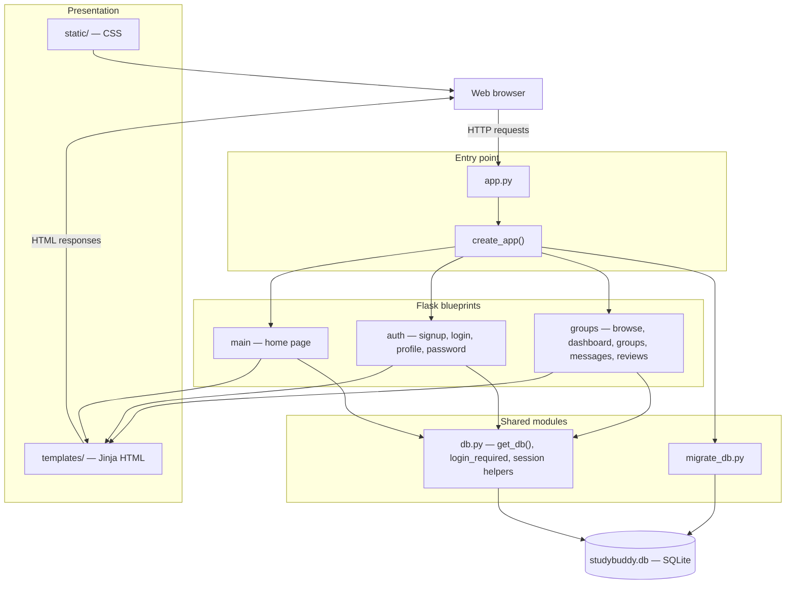
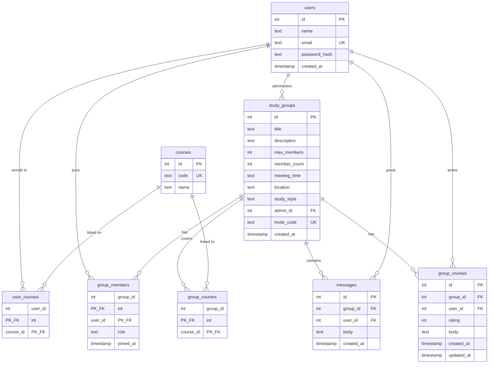

# StudyBuddy

StudyBuddy helps students create and join study groups, message group members, leave reviews, and track activity from a personal dashboard.

## Quick start

From the project root (the folder with `app.py`):

```bash
python3 -m venv venv
source venv/bin/activate          # Windows: venv\Scripts\activate
pip install -r requirements.txt
python init_db.py
python app.py
```

Open [http://127.0.0.1:5001](http://127.0.0.1:5001) in your browser.

Press `Ctrl+C` in the terminal to stop the server.

> **Note:** Inside an activated virtual environment, `python` and `pip` usually work too. On macOS, use `python3` if `python` is not installed.

## What you need

- Python 3.9+
- Git (to clone the repo)

## First-time setup

### 1. Get the code

```bash
git clone https://github.com/daniu98/StudyBuddy.git
cd StudyBuddy
```

### 2. Virtual environment

**macOS / Linux**

```bash
python3 -m venv venv
source venv/bin/activate
```

**Windows (Command Prompt)**

```bat
python -m venv venv
venv\Scripts\activate
```

**Windows (PowerShell)**

```powershell
python -m venv venv
venv\Scripts\Activate.ps1
```

Your prompt should show `(venv)` when the environment is active.

### 3. Install packages

```bash
pip install -r requirements.txt
```

### 4. Database

**First run** — creates `studybuddy.db` and loads sample courses:

```bash
python init_db.py
```

You should see: `Database initialized: studybuddy.db`

**Already have a database?** Update it without wiping your data:

```bash
python migrate_db.py
```

The app also runs migrations automatically when it starts. The database file stays on your machine and is not committed to git.

## Run the app

```bash
python app.py
```

The dev server runs at **http://127.0.0.1:5001**.

Try this flow:

1. Sign up for an account
2. Add courses on your Profile
3. Create a study group
4. Browse or search groups on Find Groups
5. Open Dashboard to see groups you joined

## Run tests

From the project root:

```bash
pytest tests/ -v
```

Or:

```bash
python3 -m pytest tests/ -v
```

- `tests/database_test.py` — signup, login, profile, group create/join/leave/edit
- `tests/end_to_end_tests.py` — full flows (course search, messaging, reviews, dashboard)

Tests back up your local `studybuddy.db` to `tempdb.db` while they run, then restore it.

## Project layout

```text
StudyBuddy/
├── app.py              # Start the app from here
├── init_db.py          # Fresh database
├── migrate_db.py       # Upgrade existing database
├── schema.sql          # Tables and seed courses
├── studybuddy/         # App code (routes, auth, groups)
├── templates/          # HTML pages
├── static/             # CSS
└── tests/              # pytest tests
```

## Architecture

StudyBuddy is a server-rendered Flask app. The browser sends HTTP requests to route handlers in Flask blueprints; handlers read and write a local SQLite database and return HTML pages.

### Diagram 1: Application layers

This diagram shows how the main parts of the system connect at runtime. `app.py` starts the Flask app created by `create_app()`. Three blueprints (`main`, `auth`, `groups`) handle routes. Shared database access lives in `db.py`. Pages are rendered from Jinja templates in `templates/` with CSS from `static/`. On startup, `migrate_db.py` applies schema updates to `studybuddy.db`.



### Diagram 2: Database schema

This diagram matches `schema.sql`. Users enroll in courses through `user_courses`. A user who creates a group is stored as `admin_id` on `study_groups`. Membership, linked courses, messages, and reviews all hang off the group. Each user can leave one review per group.



Together, the two diagrams describe the same system from different angles: the first shows **request flow and code modules**; the second shows **how data is stored and related**. A typical path through both is: a logged-in user hits a route in the `groups` blueprint, which queries `group_members` and `messages` in SQLite, then renders a template such as `group_detail.html`.

## Troubleshooting

**`ModuleNotFoundError: No module named 'flask'`**

Activate the virtual environment and install dependencies again:

```bash
source venv/bin/activate
pip install -r requirements.txt
```

**Port 5001 already in use**

Stop the other process, or change the port in `app.py`.

**Errors after pulling new code**

```bash
python migrate_db.py
```

To reset completely (deletes local data):

```bash
rm studybuddy.db
python init_db.py
```

**Tests fail with database errors**

Run pytest from the project root, not from inside `tests/`:

```bash
cd /path/to/StudyBuddy
pytest tests/ -v
```
